# ing-lab-4

## Trabajo Practico N°1

### __1- Descargar Git y eleccion de IDE__

* Descargar e instalar Git
* Elegir IDE como cliente visual. En mi caso elegi VS Code.

### __2- Crear un repositorio local y agregar archivos__

* Creo un repositorio local en un directorio de nuestra pc.

    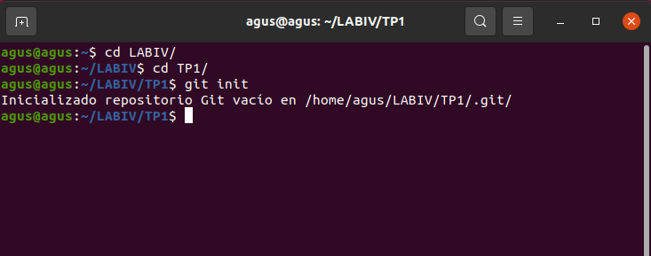

* Agrego un archivo README.md, que contiene mi nombre y un link al archivo CV.md. Este ultimo estara al mismo nivel de carpeta .
    * [README.md](https://github.com/dbobadillabarcelo/TP1-Sistemas-de-control-de-versiones)
    * [Mi CV](https://github.com/dbobadillabarcelo/TP1-Sistemas-de-control-de-versiones/blob/master/CV.md)

    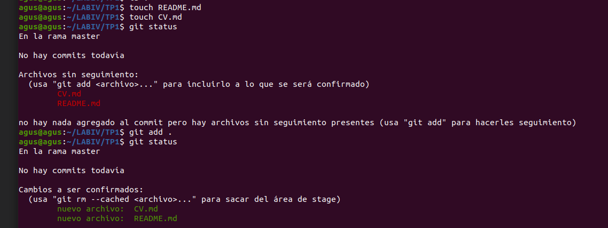
    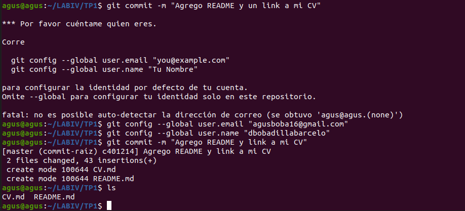

### __3- Crear un repositorio remoto__

* Creo repositorio en GitHub.

* Asocio el repositorio local con el repositorio de Github y subo lo local al repo.

    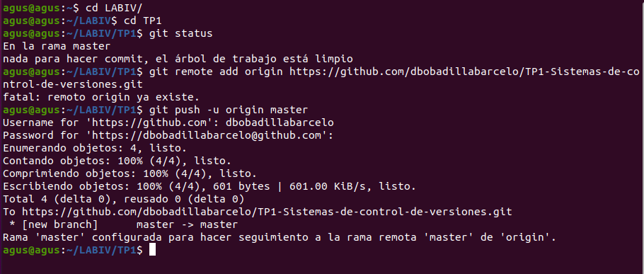

### __4- Familiarizarse con el concepto de Pull Request__

* Creo un branch local y agrego los cambios a dicho branch
    

     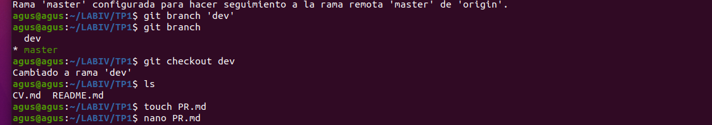

* [Pull Request](https://github.com/dbobadillabarcelo/TP1-Sistemas-de-control-de-versiones/blob/master/PR.md)

* Subo el cambio a dicho branch y creo un pull request.

    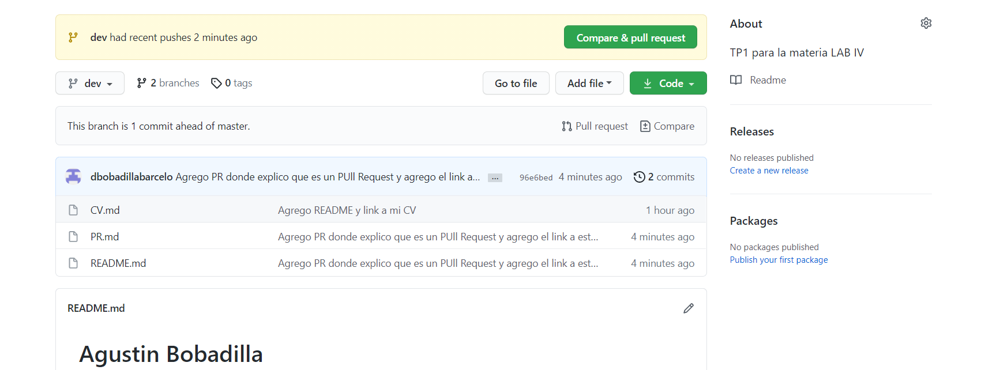

    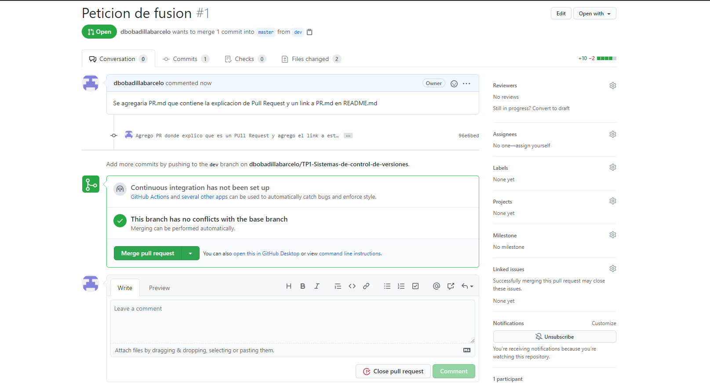

* Dentro de GitHub completo el proceso de revisión y mergeo PR a la rama master.

    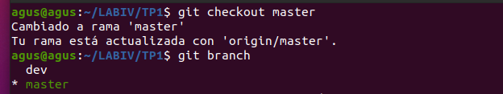
    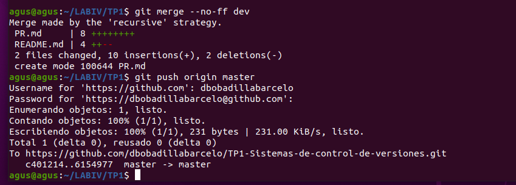

### __5- Mergear código con conflictos__

*   Creo un segundo directorio y clonamos el repo de GitHub.
*   En el primer directorio, modifico el CV.md cambiando algunas lineas.
*   Hago commit y subo el cambio a master en GitHub.
*   En el clon hago cambios en las mismas lineas del CV.
*   Intento subir el cambio, haciendo un commit y luego un push. Se genera un conflicto ya que no sabe con cual quedarse.

    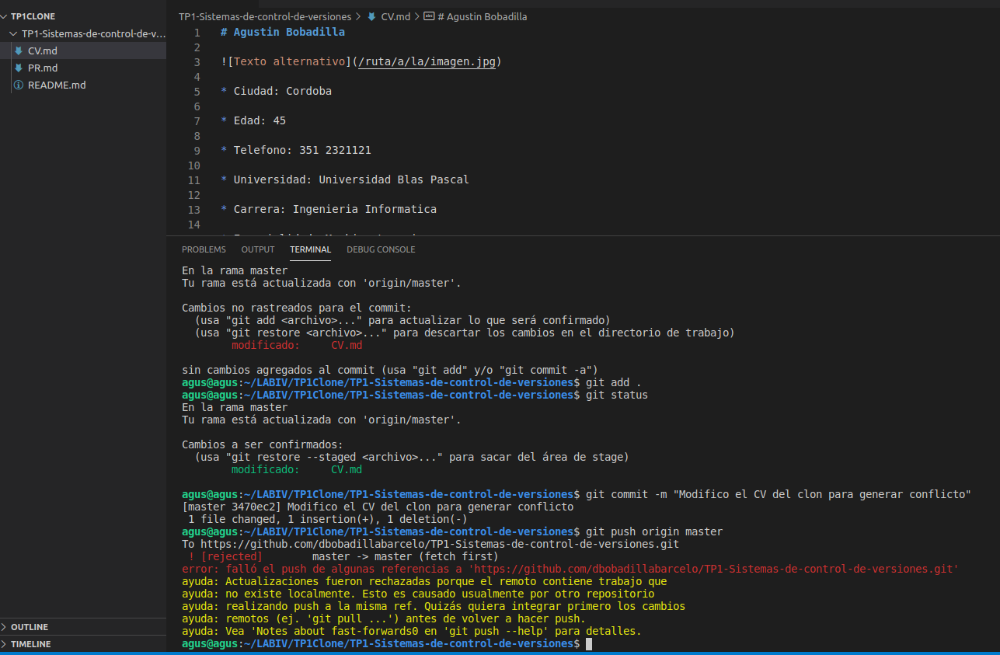

*   Resolvemos los conflictos del código eligiendo alguna de las opciones.
   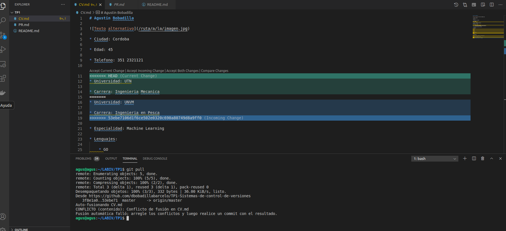

*   Explicamos el significado de las versiones LOCAL, BASE y REMOTE en el README.
    * [LOCAL, BASE, REMOTO](https://github.com/dbobadillabarcelo/TP1-Sistemas-de-control-de-versiones)      
*   Pusheamos el cambio mergeado.

     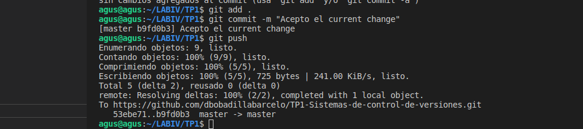

### __6- Algunos ejercicios online__

*   Entro a la página https://learngitbranching.js.org/
*   Completo los ejercicios de Introduction Sequence

    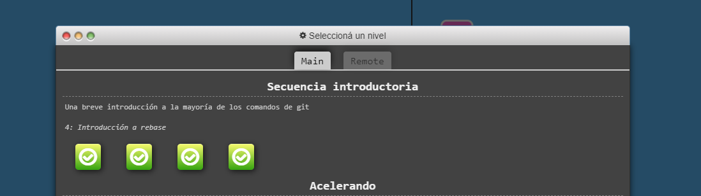
